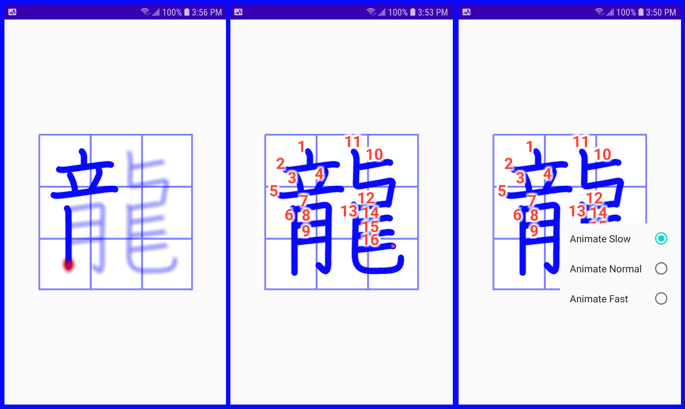

# KvgAnimatedView
This is an Android Custom View for viewing an animated rendering of Kvg Kanji Stroke Files.

The <a href="https://kanjivg.tagaini.net/">KanjiVG Project</a> has put together an extensive set of SVG image files that contain
stroke information on about 11,000 Kanji and Kana characters.  The information 
contains the path and
stroke order making many kinds of tools for teaching and learning Kanji possible.
Possibilities are really only limited by your imagination.

This code implements a CustomView for Android that simplifies presentation of
the kanji stroke information as an animation.  The user interface in this demo
app is really simple: you enter the character you want to see an animated
view of in a text window and press the animate button.

You will need to download the SVG image files from the KanjiVG Project.  The link
above is to their home page and there is a download link on the page.

After you have downloaded and unzipped the SVG files they need to be copied to
the app/src/main/assets/svg directory in the app code.

The application is implemented in Kotlin.  Sometimes I get really frustrated
with the language but personally I think it's a huge improvement over Java.

Code for the custom view is found in the AnimatorView.kt file.  KanaAnimator.kt
activity is the interface to the AnimatorView.  The code for reading the SVG
files and converting to Android Paths is in KvgToAndroidPaths.kt.  And a really 
simple UI will be found in MainActivity.kt.

This project first started several years ago.  Animation is accomplished using 
Path and PathMeasure.  The article I initially started with is on c05mic.com 
on an article titled 
<a href="https://c05mic.com/2012/03/23/animating-a-bitmap-using-path-and-pathmeasure-android/">
Animating an image using Path and PathMeasure – Android.</a>  The view allows
the user to select 3 animation speeds and the "animation speed" is used to
determine how much distance to render per frame.

Touching the AnimationView restarts the animation.  To change the animation speed,
long-press the view and select a different speed.

Each frame is started with invalidation of the view.

I have an app on both Google Play and Amazon called KanaCard that uses the AnimatorView.
You can use to get a feel for the from this app.  It only displays Kana and doesn't 
put up stroke count numbers but it is the same custom view.
The GooglePlay or Amazon links below will take you to the app.

To be honest, I've only tried a few hundred of the 11,000 files available but those 
all work.  If you have problems, please feel free to let me know.

If you find this code useful, please let me know.

Have Fun 
Steve S. 
Oct. 2, 2020

Oct. 7, 2020 
The following attributes were added:
* app:animate_background
* app:animate_stroke_width
* app:animate_stroke_color
* app:animate_cursor_color
* app:grid_color
* app:annotate_text_size
* app:annotate_text_color

Use these in animator_view.xml to over-ride the defaults.

	

      
 

